# My CycleGAN
It is my implementation of CycleGAN.  
The original [paper](https://arxiv.org/abs/1703.10593)

## Horse2Zebra  
First i tryed [horese2zebra dataset](https://www.kaggle.com/datasets/balraj98/horse2zebra-dataset)

On the left is the original picture, on the right it is changed, but it is obvious)  
Horses to zebras translation:
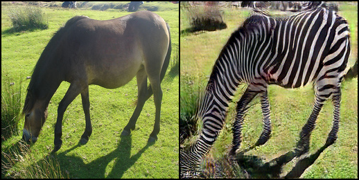 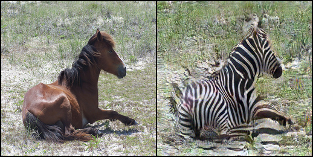 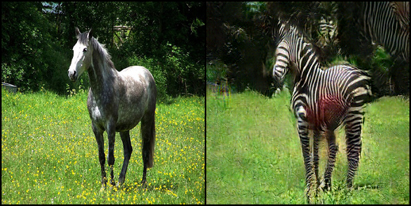
Zebras to horses translation:
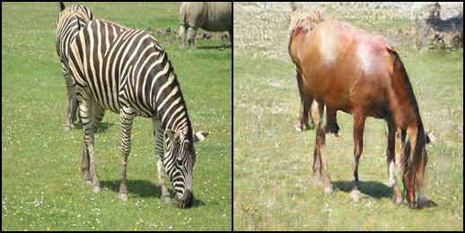 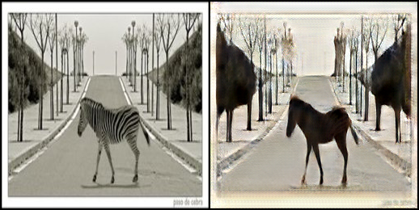 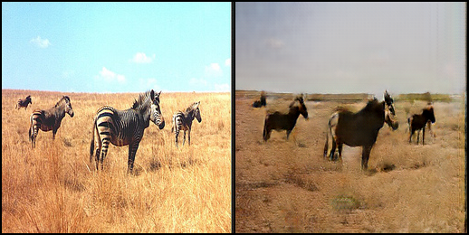

###  Couple of notes
* NN(neural network) doesn't know that we only want to translate zebras, so NN also often changes the color of the grass from green to yellow. This is because zebras live in Africa in dry savannas where the grass is yellow and most of the photos with zebras are taken there  
* NN does not work well when a person is riding a horse, since zebras are not ridden, therefore there are no photos of a person riding a zebra in train dataset  
* NN doesn't work well with boundaries between multiple horses

<todo paste here some examples>
.

## Summer2Winter  
Then i took [this dataset](https://www.kaggle.com/datasets/balraj98/summer2winter-yosemite)

Summer to winter translation:
The third images i found interesting, NN made snowdrop flower
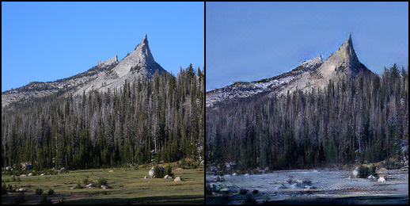 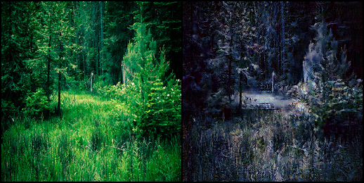 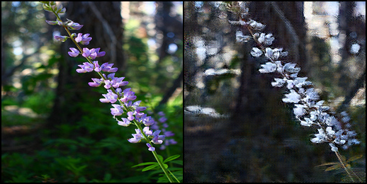
Winter to summer translation:
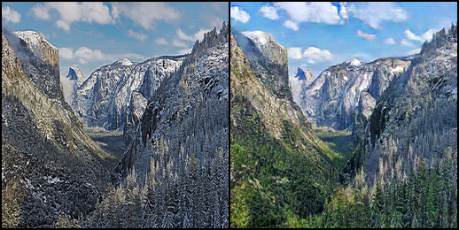  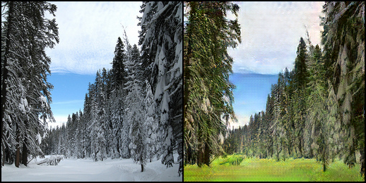

* I got moderately good results
* The translation from winter to summer does not work in the best way. Most likely there was not enough epochs
* Source photos taken in winter had a "blue" filter, and summer ones had a "contrast" filter. Often NN has applied these filters to the images

## Training
* As in the original article, I number of epochs = 200
* I used LR sheduler with warmup on 30 epoch

